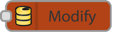

# Firebase nodes for Node-RED

     

---

Check it out! Now you can access your Firebase data with Node-RED! 
This allows you to automate Firebase data manipulation or generate custom events based on what's going on with your data store.

  

## Dedicated to

**If you are using**

- the fantastic program [Node-RED](http://nodered.org), 
- and you wanna interact with [Firebase API](https://www.firebase.com) [1](#glossary),

**that node is made for you!**

---

## Features

1. **Modify node**
	- [SET](https://www.firebase.com/docs/web/api/firebase/set.html), [PUSH](https://www.firebase.com/docs/web/api/firebase/push.html), [UPDATE](https://www.firebase.com/docs/web/api/firebase/update.html), [REMOVE](https://www.firebase.com/docs/web/api/firebase/remove.html) record
2. **Watch node**
	- Watch [on changes](https://www.firebase.com/docs/web/api/query/on.html) _Firebase_ API childs and send content to the output of the node
3. **Query node**
	- Query to a value of a Firebase node

## Installation

	cd ~/.node-red
	npm install node-red-firebase
	node-red -v

Open your *Node-RED* Frontend and you will find the new node under the group *output*. **Happy wiring!**

## Demo
Check out the demo flows to see the Firebase nodes in action, you can start Node-RED with

    node-red node_modules/node-red-firebase/demo_flows.json

It's easiest to see what's going on if you have the live Firebase view open in another browser window while you interact with the flows.

## Bugs, questions, contribute
- **Found a bug?** Please submit issues to the [Github issue tracker](https://github.com/vergissberlin/node-red-firebase/issues).
- **Have questions?** Please use [Gitter](https://gitter.im/vergissberlin/node-red-firebase?utm_source=badge&utm_medium=badge&utm_campaign=pr-badge&utm_content=badge) to get in contact with me
- **Wanna contribute?** Please make a [fork](https://github.com/vergissberlin/node-red-firebase#fork-destination-box) an send me an pull request.

## Thanks
Special thanks to
- Dave Conway-Jones and Nick O'Leary from IBM, founders of Node-RED.
- [hvissimo](https://github.com/hovissimo) for base of the Firebase node.

---

**Glossary **

1. *[PM2](https://github.com/Unitech/pm2) Firebase is a cloud services provider and backend as a service company based in San Francisco, California. The company makes a number of products for software developers building mobile or web applications.*

